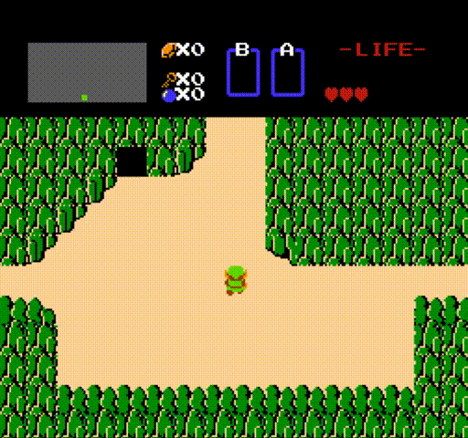

## nes

A NES emulator, so that I can waste a lot of time playing old games, but also feel like I did something constructive.

I've tried to keep the code as simple as possible, in order to facilitate others in learning how the NES works.

An accompanying blog post can be read here: https://ltriant.github.io/2019/11/22/nes-emulator.html



## Limitations

Currently, only a subset of the full system has been emulated. The following limitations apply, in order of most likely to be fixed:

1. Almost complete sound support (no DMC channel)
2. No PAL cartridge support
3. Sunsoft 5B sound support isn't added, but the only game that uses the extra sound channels, Gimmick!, plays fine (and is awesome)
4. No second controller support

The following cartridge mappers are supported:

1. NROM (mapper 0)
2. MMC1/SxROM (mapper 1)
3. UxROM (mapper 2)
4. CNROM (mapper 3)
5. MMC3/TxROM (mapper 4)
6. AxROM (mapper 7)
7. GxROM (mapper 66)
8. Sunsoft FME-7/5a/5b (mapper 69)

## Building and Running

[SDL2](https://www.libsdl.org/) is required for the graphics, and it can be installed via many different package managers:

```
$ brew install sdl2
$ sudo apt-get install libsdl2-dev
$ sudo yum install SDL2-devel
```

Or see the [libsdl installation documentation](https://wiki.libsdl.org/Installation) for more options.

The emulator is written in Rust, so the easiest way to build it is with [Cargo](https://doc.rust-lang.org/cargo/).

```
$ cargo build --release
```

The emulator can then be run by supplying the path to the ROM as an argument:

```
$ target/release/nes roms/donkey_kong.nes
```

## Controller 1 Keys

```
Up     -- W
Left   -- A
Down   -- S
Right  -- D

A      -- N
B      -- M

Start  -- Enter
Select -- Space

P      -- Pause

F12    -- Reset
```

## Debugging Information

Some graphical debugging information can be displayed by toggling the `NES_PPU_DEBUG` environment variable. At the moment this shows the palettes and the pattern table information.

```
$ NES_PPU_DEBUG=1 cargo run --release -- roms/donkey_kong.nes
```

To get full CPU debugging output printed to standard output, the `NES_CPU_DEBUG` environment variable can be toggled.

```
$ NES_CPU_DEBUG=1 cargo run -- roms/donkey_kong.nes
``` 

In order to run the nestest ROM, the CPU debugging output can be combined with the `NES_CPU_NESTEST` environment variable to also start the program counter at 0xc000.

```
$ NES_CPU_NESTEST=1 NES_CPU_DEBUG=1 cargo run -- roms/nestest.nes
``` 

Enabling of individual sound channels can be achieved with the `NES_APU_CHANNELS` environment variable. This value is an 8-bit bitmask with a bit for each channel and combinations of channels may be enabled this way. The bits are:

```
Square 1 = 1
Square 2 = 2
Triangle = 4
Noise    = 8
DMC      = 16
```

As an example:

```
$ NES_APU_CHANNELS=5 cargo run --release roms/zelda.nes
```

This will enable the first square wave channel, and the triangle wave.
